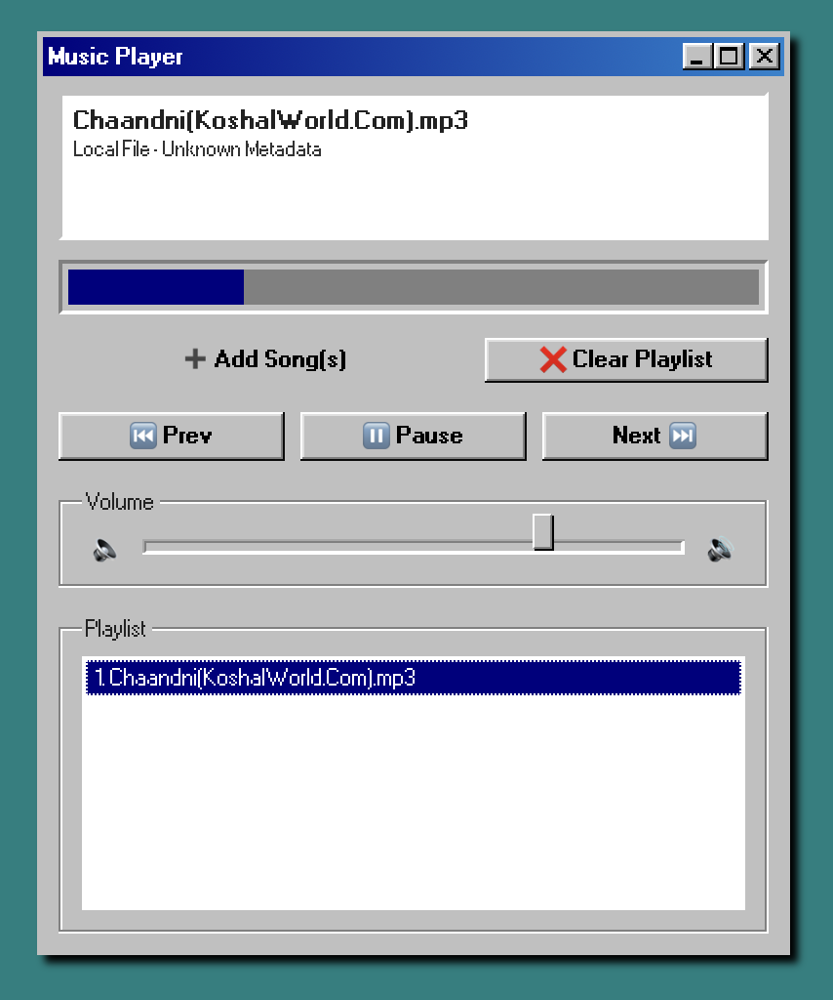

# 🎵 Windows 98 Music Player 💾

Retro vibes meet modern code — this project recreates the **Windows 98** media player aesthetic,  
complete with chunky buttons, grayscale gradients, and analog-style sliders 🖥️💿  
A nostalgic, functional web music player made using **HTML, CSS, and JavaScript**.

---

## 🖼️ Preview  

---

## 🚀 Live Demo  
🎧 **[Try It Here](https://mrsyr3x.github.io/Music-player/)**  

---

## 💡 Highlights
- 💽 **Retro Windows 98 Theme** — pure nostalgia with pixel borders and skeuomorphic buttons  
- 🎧 **Audio Playback** — play, pause, seek, and control volume  
- 📂 **Playlist Support** — queue up your favorite songs  
- 🖱️ **Smooth UX** — enjoy responsive vintage design with mouse-driven controls  

---

## 🧠 Tech Stack
- HTML — Player structure  
- CSS — Windows 98 inspired design  
- JavaScript — Audio controls and playlist logic  

---

## 🚀 How to Use
1. Choose a song from your playlist  
2. Use the retro control panel to play, pause, or seek  
3. Adjust volume with the slider — just like the old days 🎚️  

---

### ✨ Why It’s Special
A **blast from the past**, coded for the present — nostalgic UI meets clean, functional modern JS.  
Feels like booting up your PC in 1998... but smoother 💾💫

---